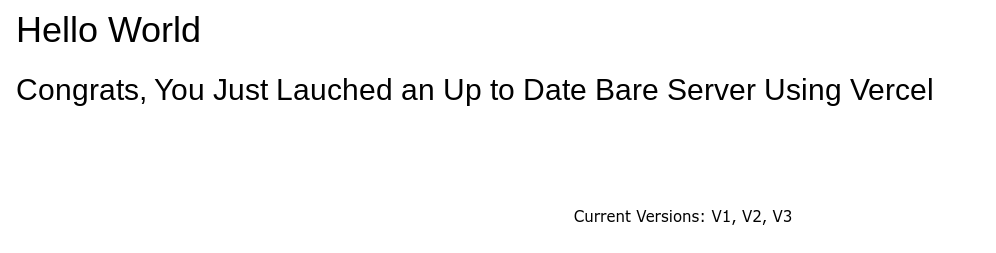

# Flux
## How to make your own server: 
Go to the repo at https://github.com/sauc23/Vercel-Bare-Server  
from there fork it and deploy it  
then go  to the site, it should look like this:  
  
then go into the flux/uv/uv.config.js of your fork of flux (yea if you want your own flux link you will have to fork it) 
and change the line i have pointed out in there to your new bare server URL 

### If you have questions, feel free to put them in the issues of this repo! 
#### If this does not work, I will be making a second version of flux that uses wisp, which is better

